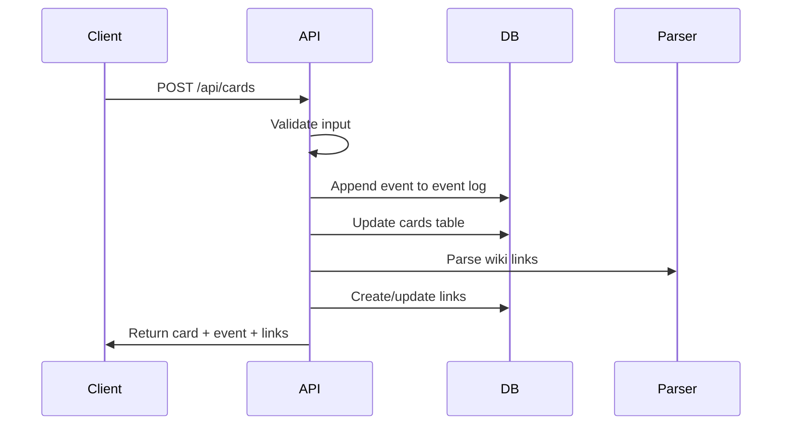

# API Server Element

## Purpose
This element defines the REST API layer built with Hono that exposes all Bartleby functionality. The API validates requests, manages events, updates materialized views, and serves responses.

## Classification
- **Domain:** Backend Service
- **Stability:** Semi-stable
- **Abstraction:** Structural
- **Confidence:** Established

## Technology

**Framework:** Hono (lightweight, TypeScript-native web framework)
**Runtime:** Node.js 20+
**Database:** SQLite (via better-sqlite3)

## API Design Principles

1. **RESTful**: Standard HTTP methods (GET, POST, PATCH, DELETE)
2. **Resource-based URLs**: `/api/cards/:id`, `/api/links/:id`
3. **Events in responses**: Mutations return both updated entity and the event
4. **Consistent format**: All responses follow SuccessResponse or ErrorResponse pattern
5. **API-first**: All features accessible programmatically

## Core Endpoints

### Cards
- `GET /api/cards` - List/search cards
- `GET /api/cards/:id` - Get card details with links
- `POST /api/cards` - Create card
- `PATCH /api/cards/:id` - Update card
- `DELETE /api/cards/:id` - Delete card
- `POST /api/cards/:id/move` - Move card in hierarchy
- `GET /api/cards/:id/network` - Get network graph

### Links
- `GET /api/links` - List links (filtered)
- `POST /api/links` - Create link
- `PATCH /api/links/:id` - Update link
- `DELETE /api/links/:id` - Delete link

### Config
- `GET /api/config` - Get project configuration
- `PATCH /api/config` - Update configuration

### Events (Audit Trail)
- `GET /api/events` - Query event log
- `GET /api/events/stream` - Server-sent events stream

### Export
- `POST /api/export/manuscript` - Generate export
- `GET /api/export/manuscript/:exportId` - Download export ZIP

## Request/Response Format

### Success Response
```typescript
interface SuccessResponse<T> {
  success: true;
  data: T;
  event?: Event;  // For mutations
}
```

### Error Response
```typescript
interface ErrorResponse {
  success: false;
  error: {
    code: string;
    message: string;
    details?: any;
  };
}
```

## Event Processing Flow



## Middleware

1. **CORS**: Allow frontend origin
2. **JSON Body Parser**: Parse request bodies
3. **Error Handler**: Catch and format errors
4. **Request Logger**: Log all requests (development)

## Validation

- Input validation using TypeScript + runtime checks
- Foreign key validation (ensure referenced cards exist)
- Business logic validation (e.g., can't move card to be its own descendant)

## Responsibilities

- **Input validation**: Reject malformed requests
- **Event creation**: Generate and persist events
- **View updates**: Keep materialized views in sync
- **Query execution**: Retrieve data efficiently
- **Export generation**: Compile markdown bundles
- **Error handling**: Return clear error messages

## Design Decisions

1. **Hono over Express**: Lighter weight, better TypeScript support
2. **Synchronous event application**: No queue needed for single-user
3. **Materialized views**: Trade-off storage for query speed
4. **Event replay on startup**: Verify data integrity
5. **No authentication**: Single-user localhost deployment in v1

## Relationships
- **Parent Nodes:** [foundation/structure.md]
- **Child Nodes:** None
- **Related Nodes:**
  - [data-model/overview.md] - implements - Exposes data model via API
  - [wiki-link-system/overview.md] - integrates - Calls parser on card updates
  - [export-system/overview.md] - implements - Export endpoints
  - [frontend-app/overview.md] - serves - Frontend consumes API

## Navigation Guidance
- **Access Context:** Use when implementing API endpoints or debugging requests
- **Common Next Steps:** Review endpoint specifications, error handling patterns
- **Related Tasks:** API implementation, integration testing, error handling
