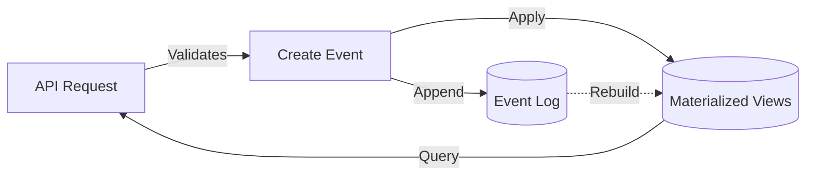

# Data Model Element

## Purpose
This element defines the core data entities and their relationships for Bartleby. The data model uses event sourcing with materialized views, where all state changes are recorded as immutable events.

## Classification
- **Domain:** Core Data Structure
- **Stability:** Static
- **Abstraction:** Structural
- **Confidence:** Established

## Key Entities

### Card
Represents any content unit (chapter, scene, character, location, note, etc.)

**Attributes:**
- `id`: UUIDv4
- `title`: String
- `content`: Markdown string
- `cardType`: User-defined type (e.g., "chapter", "character")
- `metadata`: Arbitrary JSON key-value pairs
- `parentId`: Optional reference to parent card (hierarchy)
- `position`: Integer for ordering among siblings
- `createdAt`, `modifiedAt`: Unix timestamps

### Link
Bidirectional relationship between two cards.

**Attributes:**
- `id`: UUIDv4
- `cardAId`, `cardBId`: References to connected cards
- `linkType`: User-defined or system type (e.g., "mentions", "parent-child")
- `createdFrom`: Provenance ('A' | 'B' | 'inline-A' | 'inline-B' | 'explicit')
- `metadata`: JSON with optional `inlineRefA`, `inlineRefB` wiki syntax
- `createdAt`: Unix timestamp

**Key Principle:** All links are stored bidirectionally. Both cards can traverse to each other.

### Event
Immutable record of state changes (source of truth).

**Event Types:**
- `card.created` - New card created
- `card.updated` - Card properties changed
- `card.deleted` - Card removed
- `card.moved` - Card position/parent changed
- `link.created` - New link established
- `link.updated` - Link properties changed
- `link.deleted` - Link removed
- `config.updated` - Project configuration changed

**Attributes:**
- `id`: UUIDv4
- `timestamp`: Unix timestamp
- `type`: Event type string
- `payload`: JSON containing event-specific data

### ProjectConfig
Project-level settings and type definitions.

**Structure:**
- `projectMetadata`: Title, author, custom fields
- `cardTypes`: Array of type definitions (id, label, color, icon)
- `linkTypes`: Array of link type definitions (id, label, color, bidirectional)

## Data Flow

## Storage

**SQLite Database:**
- `events` table: Append-only event log
- `cards` table: Materialized view (can be rebuilt from events)
- `links` table: Materialized view (can be rebuilt from events)
- `config` table: Materialized view (can be rebuilt from events)

## Design Decisions

1. **Event Sourcing**: Complete audit trail, enables undo/replay, supports future collaboration features
2. **Bidirectional Links**: Simplifies traversal, no "direction" concept visible to users
3. **Flexible Card Types**: User-defined types rather than rigid schema, supports diverse writing workflows
4. **Hierarchical via Links**: Parent-child is a special link type, not a database constraint
5. **JSON Metadata**: Extensible per-card data without schema migrations

## Relationships
- **Parent Nodes:** [foundation/structure.md]
- **Child Nodes:** None
- **Related Nodes:**
  - [api-server/overview.md] - consumes - API server reads and writes data model
  - [wiki-link-system/overview.md] - creates - Wiki link system generates Link entities
  - [export-system/overview.md] - reads - Export system queries data model

## Navigation Guidance
- **Access Context:** Use when understanding data structure or implementing persistence logic
- **Common Next Steps:** Review event sourcing implementation, database schema
- **Related Tasks:** Database migrations, event replay, data integrity validation
