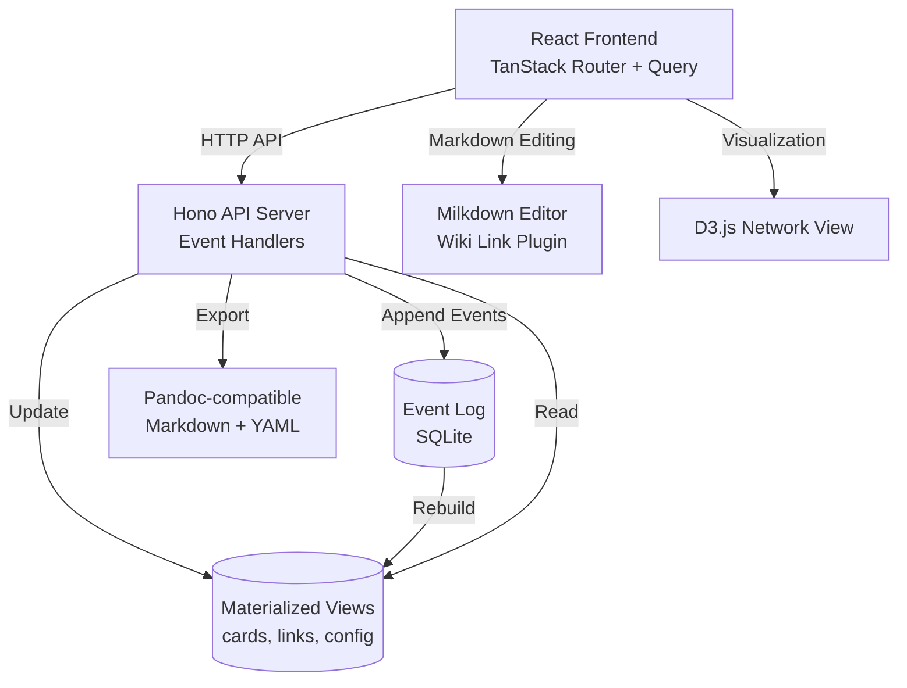
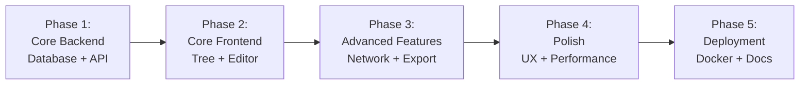

# Project Structure

## Purpose
This document provides an overview of the project structure, including key elements, their relationships, and the principles guiding their design.

## Classification
- **Domain:** Structure
- **Stability:** Semi-stable
- **Abstraction:** Structural
- **Confidence:** Established

## Content

### Structure Overview

Bartleby follows a three-tier architecture with event sourcing at its core:

1. **Data Layer**: SQLite with event sourcing pattern (event log + materialized views)
2. **API Layer**: Hono-based REST API exposing all functionality
3. **Presentation Layer**: React SPA with TanStack Router and Query

Each book project is a self-contained Docker container running all three tiers with data persisted via volume mounts.

### Key Elements

#### Event Store
The event log is the single source of truth. All state changes (card creation, updates, links, config changes) are recorded as immutable events with timestamps. Events are never deleted or modified.

**Responsibilities:**
- Persist all state-changing operations as events
- Provide chronological audit trail
- Enable event replay for rebuilding state
- Support future undo/redo functionality

#### Materialized Views (Cards, Links, Config)
Derived database tables that provide efficient querying of current state. These views are rebuilt from the event log and can be safely deleted and regenerated.

**Responsibilities:**
- Fast querying of current state
- Support for relationships (foreign keys, indexes)
- Enable complex queries (filters, searches, traversals)

#### API Server (Hono)
REST API exposing all functionality. Validates requests, appends events, updates materialized views, and returns responses.

**Responsibilities:**
- Input validation
- Event creation and persistence
- View updates
- Response formatting
- Export generation

#### Wiki Link Parser
Parses markdown content for `[[...]]` references and resolves them to card IDs. Handles ambiguous matches and ghost links.

**Responsibilities:**
- Extract wiki links from markdown
- Resolve references to card IDs
- Create/update link records
- Track unresolved references
- Support autocomplete

#### Frontend Application
React SPA with multiple views (tree, network, manuscript) for different workflows.

**Responsibilities:**
- Card management UI (CRUD operations)
- Markdown editing with wiki link support
- Network visualization
- Export triggers
- Optimistic updates

#### Docker Container
Self-contained deployment unit including Node.js runtime, built frontend, API server, and SQLite database file.

**Responsibilities:**
- Isolated book project environment
- Port mapping for multi-project hosting
- Volume mounting for data persistence
- Zero-dependency startup

### Element Interactions

**User Edits Card Content:**
1. Frontend sends PATCH request to `/api/cards/:id`
2. API validates input, creates `CardUpdatedEvent`
3. Event appended to event log
4. Materialized `cards` table updated
5. Wiki link parser extracts `[[...]]` references
6. New links created or existing links updated
7. Response includes updated card + event + affected links
8. Frontend reconciles optimistic update with server response

**User Navigates Network:**
1. Frontend requests `/api/cards/:id/network?depth=2`
2. API queries materialized views for connected cards
3. Traverses links bidirectionally up to specified depth
4. Returns center card + related cards + links
5. Frontend renders force-directed graph with D3.js

**Export Manuscript:**
1. Frontend posts to `/api/export/manuscript`
2. API determines card order (sequence links or tree traversal)
3. Resolves wiki links to relative markdown links
4. Generates markdown files + metadata.yaml
5. Creates ZIP bundle in `/exports` directory
6. Returns download URL

### Tools and Methods

| Area | Tools/Methods | Justification |
|-------|--------------|---------------|
| Backend Runtime | Node.js 20+ | Modern JavaScript runtime, excellent ecosystem |
| Web Framework | Hono | Lightweight, fast, TypeScript-native |
| Database | SQLite | Zero-config, file-based, perfect for single-user |
| Frontend Framework | React 18+ | Mature ecosystem, excellent tooling |
| Routing | TanStack Router | Type-safe, file-based routing |
| Server State | TanStack Query | Powerful caching, optimistic updates |
| UI State | Zustand | Lightweight, simple API |
| Markdown Editor | Milkdown | WYSIWYG markdown, extensible plugin system |
| Visualization | D3.js | Industry standard for network graphs |
| Build Tool | Vite | Fast dev server, optimized production builds |
| Containerization | Docker | Standard deployment, isolated environments |

### Success Criteria

#### Quality
- **Type Safety**: TypeScript throughout ensures compile-time error detection
- **Data Integrity**: Event sourcing provides audit trail and state recovery
- **Testability**: API-first design enables testing at multiple levels

#### Scalability
- **Per-Project Isolation**: Each book in separate container prevents resource contention
- **Horizontal Scaling**: Multiple books = multiple containers on different ports
- **Limited Scope**: Single-user design keeps complexity manageable

#### Security
- **Local-First**: No network exposure required (localhost only in v1)
- **SQL Injection Prevention**: Parameterized queries throughout
- **XSS Prevention**: Sanitized markdown rendering
- **No Auth in v1**: Single-user on localhost simplifies security model

#### Reliability
- **Event Sourcing**: Can rebuild state from events if views corrupted
- **SQLite**: Battle-tested, ACID-compliant database
- **Optimistic Updates**: UI remains responsive even if server slow

#### Maintainability
- **Clear Separation**: Data/API/UI layers with well-defined boundaries
- **TypeScript Interfaces**: Self-documenting contracts between layers
- **Small Files**: Individual modules under 300 lines for easier comprehension
- **API-First**: Changes to UI don't affect data layer

### Implementation Approach

Iterative development in 5 phases, each fully functional before proceeding:

**Phase Details:**
1. **Core Backend**: Event sourcing, database schema, CRUD APIs, wiki link parser
2. **Core Frontend**: React app, tree view, card editor, basic linking
3. **Advanced Features**: Network visualization, manuscript view, export system
4. **Polish**: Error handling, keyboard shortcuts, loading states, responsive design
5. **Deployment**: Dockerfile, volume config, startup scripts, user documentation

### Future Evolution

The architecture supports future enhancements without major refactoring:

**Near-term (v1.x):**
- Advanced search (full-text search via SQLite FTS5)
- Undo/redo via event replay
- Templates for common card structures
- Import from markdown files

**Mid-term (v2.x):**
- Agent integration (API already supports programmatic access)
- Real-time collaboration (operational transformation on event stream)
- Cloud sync (event log can be replicated)
- Version control integration (export events as git commits)

**Long-term (v3.x):**
- Multi-book workspace
- Publishing workflows
- Advanced analytics (character arc tracking, plot hole detection)
- Mobile apps consuming same API

## Relationships
- **Parent Nodes:** [foundation/project_definition.md]
- **Child Nodes:** 
  - [elements/*/structure.md] - details - Element-specific structural details
  - [decisions/*] - justifies - Key decisions that shaped this structure
- **Related Nodes:** 
  - [foundation/principles.md] - guides - Principles that guided structural decisions
  - [connections/dependencies.md] - details - Dependencies between elements
  - [connections/interfaces.md] - specifies - Interfaces between elements

## Navigation Guidance
- **Access Context:** Use this document when needing to understand the overall project structure and design
- **Common Next Steps:** After reviewing this structure, typically explore specific element structures or decision records
- **Related Tasks:** Project design, element development, integration planning
- **Update Patterns:** This document should be updated when there are significant changes to the project structure or methodology

## Metadata
- **Created:** 2025-11-14
- **Last Updated:** 2025-11-14
- **Updated By:** AI Agent (Claude)

## Change History
- 2025-11-14: Initial creation of structure document
- 2025-11-14: Populated with Bartleby architecture, tech stack, and implementation approach
