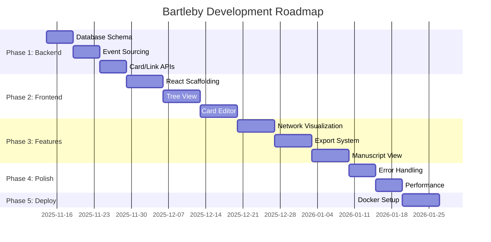

# Project Roadmap

## Purpose
This document outlines the planned development path for the project, including key milestones, features, and timelines.

## Classification
- **Domain:** Planning
- **Stability:** Dynamic
- **Abstraction:** Structural
- **Confidence:** Evolving

## Content

### Roadmap Overview

Bartleby development follows 5 phases, building from data layer to deployment. Each phase is fully functional before proceeding to the next.

**Total Duration:** 9-13 weeks
**Approach:** Iterative, layer-by-layer (Database → API → UI → Features → Deployment)

### Current Phase

**Phase: Phase 2 - Core Frontend**
**Status: In Progress**

Building the essential user interface for the writing workflow. This includes the tree view with drag-and-drop, Milkdown markdown editor integration, link panel, and basic wiki link autocomplete.

**Previous Phase (Phase 1 - Core Backend): Completed**
The foundational data layer and API have been implemented, including event-sourced SQLite database, materialized views, REST API endpoints, and wiki link parsing system. All card and link operations are functional via API calls.

### Upcoming Milestones

#### [Milestone 1 Name]
- **Target Date:** [Date]
- **Status:** [Not Started/In Progress/Completed]
- **Description:** [Brief description of the milestone]
- **Key Deliverables:**
  - [Deliverable 1]
  - [Deliverable 2]
  - [Deliverable 3]
- **Dependencies:**
  - [Dependency 1]
  - [Dependency 2]

#### [Milestone 2 Name]
- **Target Date:** [Date]
- **Status:** [Not Started/In Progress/Completed]
- **Description:** [Brief description of the milestone]
- **Key Deliverables:**
  - [Deliverable 1]
  - [Deliverable 2]
  - [Deliverable 3]
- **Dependencies:**
  - [Dependency 1]
  - [Dependency 2]

### Feature Timeline

#### Phase 1: Core Backend (2-3 weeks)
- **Timeline:** Nov 14 - Dec 5
- **Theme:** Data persistence and API foundation
- **Features:**
  - Database schema and migrations - Priority: High
  - Event sourcing implementation - Priority: High
  - Card CRUD API endpoints - Priority: High
  - Link CRUD API endpoints - Priority: High
  - Wiki link parser and resolver - Priority: High
  - Basic export functionality - Priority: Medium

#### Phase 2: Core Frontend (3-4 weeks)
- **Timeline:** Dec 5 - Jan 2
- **Theme:** Essential UI for writing workflow
- **Features:**
  - Project scaffolding (Vite + React + TanStack Router) - Priority: High
  - Tree view with drag-and-drop - Priority: High
  - Card editor with Milkdown integration - Priority: High
  - Link panel component - Priority: High
  - Basic wiki link autocomplete - Priority: Medium

#### Phase 3: Advanced Features (2-3 weeks)
- **Timeline:** Jan 2 - Jan 23
- **Theme:** Visualization and export capabilities
- **Features:**
  - Network visualization (visx) - Priority: High
  - Manuscript reading view - Priority: High
  - Config management UI - Priority: Medium
  - Ghost link resolution - Priority: Medium
  - Full export with Pandoc support - Priority: High
- **Note:** Using visx instead of D3.js directly for better React integration (see decision 005)

#### Phase 4: Polish (1-2 weeks)
- **Timeline:** Jan 23 - Feb 6
- **Theme:** Production readiness
- **Features:**
  - Error handling and validation - Priority: High
  - Loading states and optimistic updates - Priority: High
  - Keyboard shortcuts - Priority: Medium
  - Responsive design - Priority: Medium

#### Phase 5: Deployment (1 week)
- **Timeline:** Feb 6 - Feb 13
- **Theme:** Containerization and documentation
- **Features:**
  - Docker multi-stage build - Priority: High
  - Volume mount configuration - Priority: High
  - Environment variables - Priority: High
  - Startup scripts - Priority: High
  - User documentation and README - Priority: High

### Release Strategy

**Version 1.0:** Full feature set from phases 1-5, production-ready Docker container

**Approach:**
- No intermediate releases during development
- Alpha testing with Docker container after Phase 3
- Beta testing after Phase 4
- v1.0 release after Phase 5 completion
- Semantic versioning (v1.x.x for features, v1.0.x for patches)

### Resource Allocation

**Single developer (AI agent)** implementing full stack:
- 40% Backend (database, API, event sourcing)
- 40% Frontend (React, components, state management)
- 10% Infrastructure (Docker, deployment)
- 10% Documentation and polish

### Risk Assessment

| Risk | Impact | Likelihood | Mitigation Strategy |
|------|--------|------------|---------------------|
| Event sourcing complexity | High | Medium | Start simple, use clear examples, test replay early |
| Wiki link resolution ambiguity | Medium | High | Provide disambiguation UI, support type prefixes |
| Markdown editor integration issues | High | Medium | Choose battle-tested library (Milkdown), plan for alternatives |
| Network visualization performance | Medium | Low | Limit graph depth to 5, use visx with React-optimized rendering |
| Docker build complexity | Medium | Low | Follow standard Node.js patterns, multi-stage builds |
| Export format incompatibility | Medium | Low | Follow Pandoc conventions strictly, include sample exports |

### Roadmap Review Process

**Weekly reviews** during development to assess:
- Progress against timeline
- Technical blockers or risks
- Scope adjustments if needed

**Phase completion gates:**
- All high-priority features functional
- Core use cases tested manually
- No critical bugs
- Documentation updated

## Relationships
- **Parent Nodes:** [foundation/project_definition.md]
- **Child Nodes:** [planning/milestones.md]
- **Related Nodes:** 
  - [foundation/structure.md] - implements - Structure supports roadmap features
  - [processes/creation.md] - executes - Creation processes execute roadmap items

## Navigation Guidance
- **Access Context:** Use this document when planning work, prioritizing features, or communicating timelines
- **Common Next Steps:** After reviewing the roadmap, typically explore specific milestones or feature details
- **Related Tasks:** Sprint planning, resource allocation, stakeholder communication
- **Update Patterns:** This document should be updated quarterly or when significant changes to the plan occur

## Metadata
- **Created:** 2025-11-14
- **Last Updated:** 2025-11-14
- **Updated By:** AI Agent (Claude)

## Change History
- 2025-11-14: Initial creation of roadmap template
- 2025-11-14: Populated with Bartleby 5-phase development roadmap
- 2025-11-14: Updated current phase to Phase 2, marked Phase 1 as completed
- 2025-11-14: Changed Phase 3 visualization from D3.js to visx (per decision 005)
